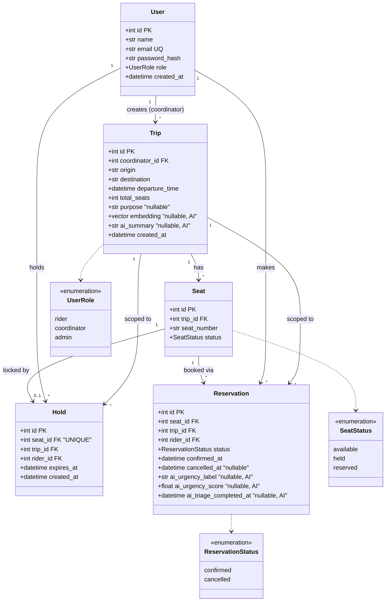

# SahyogRide — Class Diagram

Rendered image: [`diagrams/class_diagram.svg`](diagrams/class_diagram.svg)

Generated directly from `backend/app/models.py` (SQLAlchemy 2.0 ORM, 5 tables + 3 enums).
Mermaid source is included below so it can be re-rendered or edited (paste into
[mermaid.live](https://mermaid.live) or the VS Code Mermaid extension).

## Design notes

- **`Hold` rows are deleted, not soft-deleted** — `UNIQUE(seat_id)` on `holds` means at most one
  hold row can exist per seat *at all*. This is layer 2 of the three-layer concurrency defense
  (see CLAUDE.md and `services/booking.py::hold_seat`).
- **`Reservation` rows are kept for history** — cancellation sets `status='cancelled'` rather than
  deleting, which is why its uniqueness constraint is a *partial* index
  (`UNIQUE(seat_id) WHERE status='confirmed'`) instead of a plain unique column.
- **AI columns are nullable everywhere** (`Trip.embedding`, `Trip.ai_summary`,
  `Reservation.ai_urgency_*`) — the domain model must be fully valid with every AI column `NULL`,
  per CLAUDE.md rule #3.
