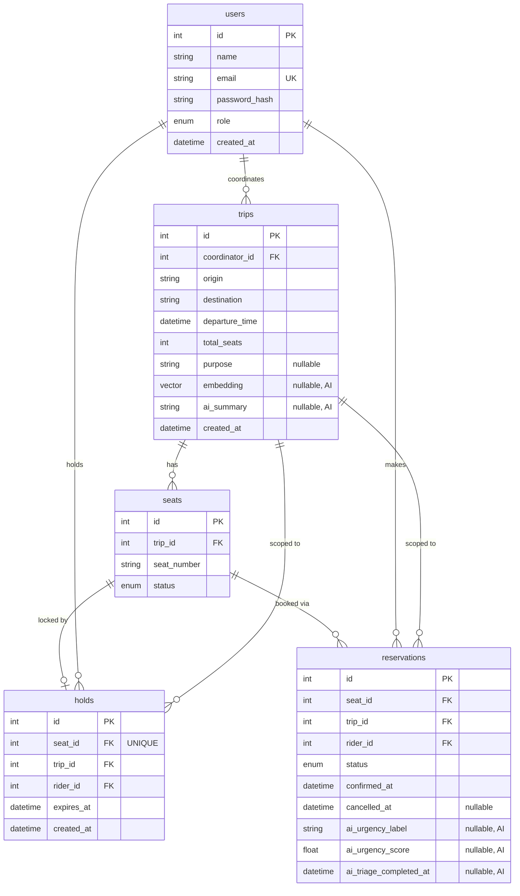

# SahyogRide — Database Design

Rendered image: [`diagrams/er_diagram.svg`](diagrams/er_diagram.svg)

PostgreSQL 15+ with the `pgvector` extension. Schema, migrations owned by Alembic
(`backend/alembic/`). Full reference SQL for the two concurrency constraints lives in
`docs/ER_DIAGRAM.md` — this document summarizes it visually.



## The two DB-level concurrency constraints (layers 2 & 3)

Layer 1 is the `SELECT ... FOR UPDATE` row lock in `services/booking.py::hold_seat()`. These two
are enforced by Postgres itself, so they hold even if application code has a bug:

```sql
-- Layer 2: at most one hold row can exist per seat, ever (active or not)
ALTER TABLE holds ADD CONSTRAINT holds_seat_id_key UNIQUE (seat_id);

-- Layer 3: at most one CONFIRMED reservation per seat; cancelled rows don't count
CREATE UNIQUE INDEX uq_reservations_seat_confirmed
  ON reservations (seat_id)
  WHERE status = 'confirmed';
```

This is why `holds` rows are **deleted** on expiry/release/confirm (a plain `UNIQUE` can't
distinguish active from inactive), while `reservations` rows are **kept** on cancellation and
rely on a **partial** index instead.

## Enum storage

`users.role`, `seats.status`, `reservations.status` are native Postgres enum types storing the
lowercase `.value` (`"confirmed"`, not `"CONFIRMED"`) via SQLAlchemy's `values_callable` — required
so the partial index predicate (`WHERE status = 'confirmed'`) matches what's actually stored.

See `docs/ER_DIAGRAM.md` for the full narrative and verification notes.
